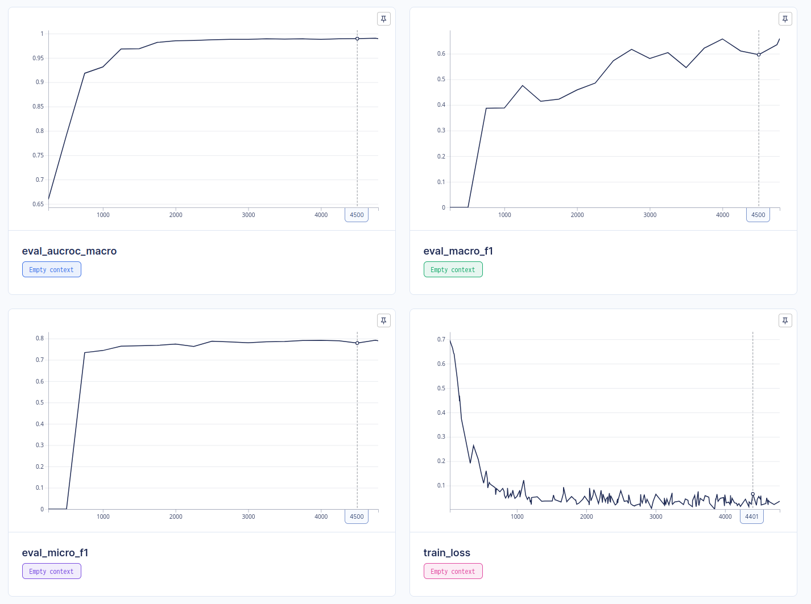
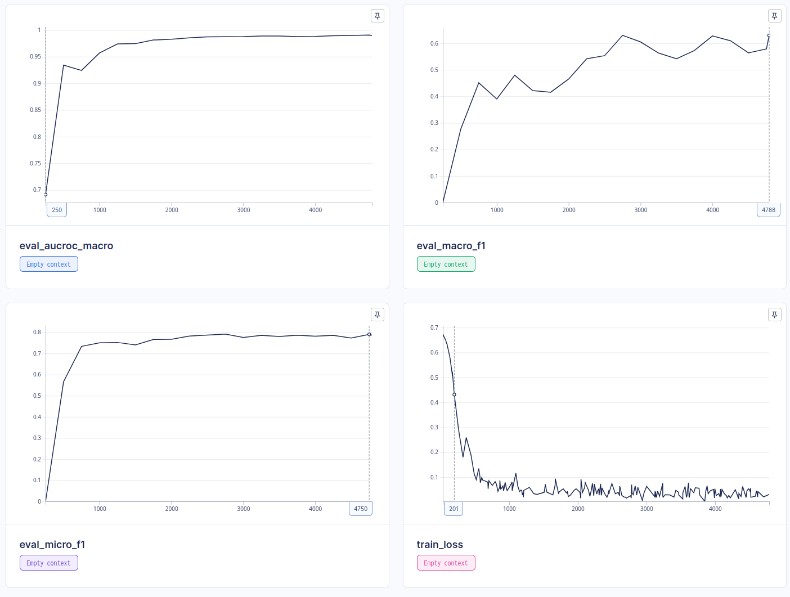
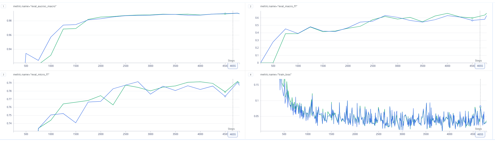

# Эффективный Multilabel классификатор

## Описание задачи

Реализовать модель, которая бы эффективным образом предсказывала классы для данных из [Toxic Comment Classification Challenge](https://www.kaggle.com/competitions/jigsaw-toxic-comment-classification-challenge)

## Описание решения

Нами было предложена классическая архитектура для подобных задач в качестве baseline:

1. Предобученная модель _google-bert/bert-base-uncased_ в качестве энкодера
2. Pooling [batch_size, seq_length, hidden_size] -> [batch_size, hidden_size]
3. Head [BATCH x HIDDEN_SIZE] -> tanh -> [BATCH x NUM_CLASSES]

## Гипотеза

Использование среднего от всех токенов у pooler'а модели, а не только [CLS] токена улучшит результаты.

## Обучение

`config.py` - структура конфига и его валидация.

`const.py` - константы с именем модели энкодера и классов.

`dataset.py` - обработка датасета.

`export_onnx.py` - выгрузка моделей в формате onnx в зависимости от параметра `--avg`.

`inference.py` - предсказание для тестового предложения на основе модели из выгруженного onnx.

``model.py`` - основной код двух моделей: `MultiLabelPoolerWithHead` и  `MultiLabelAvgPoolerWithHead`.

`train.py` - обучение моделей в зависимости от конфига и архитектуры.

### Обучение baseline модели

1. Установить все необходимые зависимости с помощью poetry

   ```shell
   poetry install
   ```
2. Запустить процесс обучения

   ```shell
   poetry run <your_python> multilabel/train.py --config-path configs/multilabel.json
   ```

### Обучение average модели

1. Установить все необходимые зависимости с помощью poetry, если не запускался предыдущий шаг

   ```shell
   poetry install
   ```
2. Запустить процесс обучения

   ```shell
   poetry run <your_python> multilabel/train.py --config-path configs/multilabel_average.json
   ```

### Выгрузка и просмотр результатов

1. Создать архив с результатами обучения из `.aim`

   ```shell
   tar -czvf aim_repo.tar.gz .aim
   ```
2. Скопировать архив в папку aim

   ```shell
   cp aim_repo.tar.gz ./aim/
   ```
3. Зайти в директорию aim и запустить docker compose

   ```shell
   сd aim && docker compose up -d
   ```

## Результаты

Обучение производилось на *Nvida Tesla A100 40GB*

### Метрики baseline модели

| metric            | value      |
| ----------------- | ---------- |
| eval_aucroc_macro | 0.98977888 |
| eval_macro_f1     | 0.65930855 |
| eval_micro_f1     | 0.78948092 |
| train_loss        | 0.03557318 |



### Метрики average модели

| metric            | value      |
| ----------------- | ---------- |
| eval_aucroc_macro | 0.98983848 |
| eval_macro_f1     | 0.6294353  |
| eval_micro_f1     | 0.78685367 |
| train_loss        | 0.03070794 |



### Сравнение моделей

Синим цветом отмечены метрики `average`, а зеленым - `baseline`

Из графиков можно отметить, что average и baseline модели имели отличия в метриках во время обучения, но к концу обучения они были минимальны, но с перевесом в сторону `baseline`.



## Заключение

 В заключение можно сказать, что наша гипотеза себя не оправдала - различия `baseline` и `average` моделей не оказались значительными, `average`, наоборот ухудшает результат.
